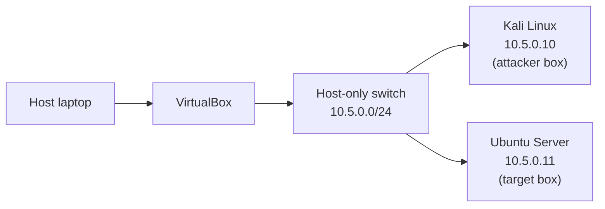

# Lab Zero — Isolated Security Lab

## Why this exists

Before touching any of the actual security projects (hardening, pipeline
scanning, SIEM, the vuln-triage agent), a safe place to break things was
needed. Lab Zero is that place — a small two-VM lab running entirely on a
host-only network, with no route out to the real network or the internet.
If something goes wrong in here (and something already has, see below), it
stays in here.

## Setup

Two VMs, both on VirtualBox, both on the same host-only virtual switch:

There's no line connecting that switch to anything outside the hypervisor —
that's the whole point.

**Kali Linux** is the attacker box — this is where scans and tooling get run
from.

**Ubuntu Server** is the target — the machine that gets hardened in the next
project (Harden It), and later gets scanned/attacked from Kali.

The host-only network's built-in DHCP was turned off, and both machines got
static IPs instead:

| Machine | IP | Gateway |
|---|---|---|
| Kali | 10.5.0.10/24 | none |
| Ubuntu Server | 10.5.0.11/24 | none |

No gateway on either one, on purpose — there's nothing on this network for
them to route through anyway, and it's one less thing that could accidentally
leak traffic out.

## Making sure it's actually isolated

The isolation wasn't just assumed — it was tested:

- Kali → Ubuntu (`ping -c 4 10.5.0.11`) — worked, as expected
- Ubuntu → Kali (`ping -c 4 10.5.0.10`) — worked
- Kali → 8.8.8.8 — timed out, 100% packet loss
- Ubuntu → 8.8.8.8 — same, timed out completely

Exactly what should happen: the two VMs can talk to each other, but neither
one has any way out.

Shared clipboard and drag-and-drop were also disabled on both VMs in the
VirtualBox settings. That's a separate isolation gap from the network config
— it closes off the host-to-guest data path directly through the hypervisor,
which the network settings wouldn't touch.

Once everything checked out, both VMs were snapshotted as
`clean-baseline-pre-hardening` so the environment can always be reset back to
this exact state before starting a new project.

## Setting this up

1. Install VirtualBox, create a host-only network (File → Tools → Network
   Manager), and leave its DHCP server off.
2. Create two VMs (Kali and Ubuntu Server here), and set Adapter 1 on both to
   Host-only, pointed at the network from step 1. Leave the other adapters
   disabled.
3. Give each one a static IP on that subnet:
   - Kali: `nmcli con mod "<connection>" ipv4.addresses <ip>/24 ipv4.method manual`
   - Ubuntu: add `addresses: [<ip>/24]` to the netplan config, then
     `sudo netplan apply`
   - Skip the gateway and DNS on both.
4. Turn off Shared Clipboard and Drag'n'Drop (Settings → General → Advanced)
   on both VMs.
5. Boot everything and run the same ping tests above to confirm it's actually
   isolated.
6. Snapshot both VMs once satisfied with the state.

## The boot issue

Ubuntu Server wouldn't boot the first time around — it dropped into a dracut
emergency shell with `sulogin: failed to execute /bin/bash`, which is not a
fun thing to see. Turned out the install has full-disk LUKS encryption on
`/dev/sda3`, and the automatic passphrase prompt at boot just didn't go
through properly.

It was unlocked manually from the rescue shell with
`cryptsetup luksOpen /dev/sda3 cryptroot`, which confirmed the encryption and
passphrase were both fine — nothing was actually broken. A normal reboot
after that went straight into Ubuntu with no issues, and it hasn't happened
again since. Chalked up to a one-off timing glitch at boot rather than
anything wrong with the disk.

## Where things stand

- [x] Both VMs built
- [x] Host-only network set up, static IPs instead of DHCP
- [x] Isolation tested and confirmed
- [x] Snapshots taken (`clean-baseline-pre-hardening`)
- [x] Written up (this file)
- [x] Pushed to GitHub
