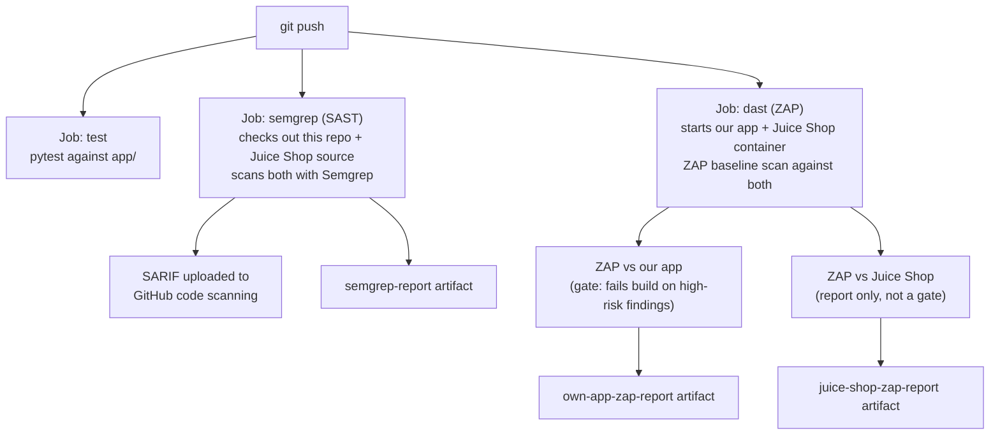

# Shift-Left Pipeline — Semgrep SAST + OWASP ZAP DAST

## Why this exists

The first two projects (Lab Zero, Harden It) are about securing infrastructure
that already exists. This one is about catching problems *before* code ever
reaches production — "shift-left" means moving security checks as early into
the development pipeline as possible, ideally into every push, instead of
bolting a scan on at the end.

This project wires two different kinds of automated security scanning into a
GitHub Actions pipeline that runs on every push:

- **SAST (Static Application Security Testing)** — [Semgrep](https://semgrep.dev)
  reads the source code itself, without running it, looking for known-bad
  patterns (hardcoded secrets, injection-prone code, insecure defaults, etc).
- **DAST (Dynamic Application Security Testing)** — [OWASP ZAP](https://www.zaproxy.org/)
  attacks a *running* copy of the app over HTTP, finding issues that only show
  up at runtime (broken auth, missing security headers, XSS reflected in
  actual responses).

Both run automatically, on every push, with no manual step required.

## What gets scanned

| Target | SAST (Semgrep) | DAST (ZAP) | Why |
|---|---|---|---|
| Our own demo app (`app/`, a small FastAPI service) | Yes | Yes | Every real pipeline scans its own code — this is the "shift-left" habit itself |
| [OWASP Juice Shop](https://owasp.org/www-project-juice-shop/) | Yes | Yes | Deliberately built by OWASP to contain real, catalogued vulnerabilities, so the pipeline has something genuine to find and this project has real findings to document — our own app is too small and clean to produce interesting results on its own |

Juice Shop's source and its running container both only exist for the
duration of a single CI job — nothing is downloaded or committed into this
repo. See the workflow file for exactly how: `actions/checkout` pulls its
source for the Semgrep job, and `docker run bkimminich/juice-shop` starts it
as a container for the ZAP job.

## Pipeline architecture



Three jobs run in parallel on every push or pull request that touches this
folder:

1. **`test`** — runs the existing pytest suite against the FastAPI app.
2. **`semgrep`** — checks out this repo and, separately, Juice Shop's source
   into a `juice-shop/` folder; runs Semgrep with the `p/security-audit` and
   `p/owasp-top-ten` rulesets against both; uploads results as a SARIF file
   to GitHub's Security -> Code scanning tab, plus as a downloadable artifact.
3. **`dast`** — starts our own app locally on the runner (`uvicorn`) and
   Juice Shop as a Docker container, then runs ZAP's baseline scan against
   each. The scan against **our own app is a real gate** — the build fails if
   ZAP finds anything high-risk. The scan against Juice Shop is
   report-only (it will always find things; that's the point), so it never
   blocks the pipeline.

## Running it

The pipeline runs automatically on every push to `main`/`master` or pull
request that touches files under this folder. No local setup is required to
trigger it — just push.

To run the demo app locally:

```bash
cd 03-shift-left-pipeline
pip install -r app/requirements.txt
uvicorn app.main:app --reload
```

## Findings

*(To fill in after the first pipeline run — pull the actual numbers from the
Actions run's Semgrep and ZAP artifacts, and from the GitHub Security tab.)*

- Semgrep findings in our own app:
- Semgrep findings in Juice Shop:
- ZAP findings against our own app:
- ZAP findings against Juice Shop:
- Anything notable worth calling out (a specific CVE-class bug Juice Shop
  surfaced, a false positive worth explaining, etc.):

## Evidence

Screenshots of the pipeline running, the Actions summary, and the
Semgrep/ZAP reports go in `evidence/` (Actions run overview, Security tab
code-scanning alerts, ZAP report excerpt).

## Where things stand

- [x] Demo FastAPI app + pytest suite
- [x] GitHub Actions workflow scaffolded (test / semgrep / dast jobs)
- [x] Semgrep wired up against our own app + Juice Shop source
- [x] ZAP wired up against our own app (gate) + Juice Shop (report only)
- [ ] First pipeline run verified green (or issues fixed)
- [ ] Findings section filled in with real results
- [ ] Evidence screenshots added
- [ ] Pushed to GitHub
